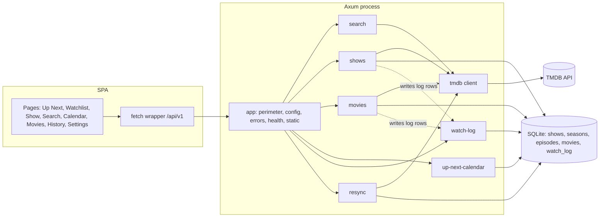

# High-Level Design: Showrunner

## Problem

Someone who follows many TV shows across cable and streaming loses track of which episode of which show is next, what aired while they were away, and which movies they meant to watch. Existing trackers are hosted services with accounts, ads, or data they keep. Showrunner is a single-household tracker that runs on a home server, keeps its data in one SQLite file, and asks nothing of the user beyond a TMDB API key.

## Approach

Mirror each tracked show's season and episode tree from TMDB into a local database once, keep one bit of user state per episode (`watched`), and derive everything the user sees from that tree against "today" in their timezone. Refresh the mirror on a schedule without ever touching watched state. Treat movies as a flat to-watch list. Record every watched and unwatched action in an append-only log. Serve the API and the single-page app from one Rust process in one distroless container.

## Target Users

One household running a homelab: comfortable with Docker Compose and an environment file, reaching the app over a LAN or a reverse proxy they control, and willing to trust that network because the app has no accounts.

## Goals

1. **Watched state survives every resync.** No scheduled or manual refresh ever changes a `watched` flag or a `watched_at` timestamp.
2. **The next episode is one click from home.** Up Next shows the oldest unwatched aired episode per show, most overdue first, with a one-click advance.
3. **Airing shows never go stale.** A newly announced episode of a still-airing show appears within one scheduled resync.
4. **The TMDB key never leaves the server.** Not in the browser, not in a response body, not in a log line.

## Non-Goals

- Authentication, authorization, and multi-user support. A known future design topic, not an incremental addition.
- Exposure to the public internet.
- Data sources other than TMDB.
- Deployment shapes other than one container with one SQLite file.
- Movies on the calendar, in Up Next, or in resync; those views are episode-driven.

## Tenets

Ordered: when two conflict, the earlier one wins.

1. **User state outranks TMDB.** When mirroring TMDB faithfully would alter something the user did (a watched flag, progress on a renumbered or withdrawn episode), keep the user's state and let the mirror drift.
2. **Bound the anonymous caller rather than authenticate.** Until the auth design lands, every new endpoint gets a cost ceiling (a cap, a cooldown, a size or time limit) instead of a login.
3. **Server computes, client renders.** Derived values such as aired, remaining, progress, and ordering come from the API; the client formats them and never recomputes them.
4. **Friendly over precise for upstream errors.** Users see a readable sentence and what to do next, never a raw TMDB status.

## System Design

Nine leaf segments sit directly under this document. Five are about titles, two keep metadata fresh, two are the platform.

| Segment | Owns | Design |
|---|---|---|
| `search` | TMDB multi-search proxy, `already_tracked`, the Search page and its Add flow | docs/intent/search/search-design.md |
| `shows` | Add, list, detail, remove; single and bulk watched-state mutations; the definition of "today" and "aired" | docs/intent/shows/shows-design.md |
| `movies` | The flat to-watch list; mark watched (delete and log) vs remove (delete) | docs/intent/movies/movies-design.md |
| `up-next-calendar` | The per-show next-unwatched view and the month grid | docs/intent/up-next-calendar/up-next-calendar-design.md |
| `watch-log` | The append-only history table, its read endpoint, the History page | docs/intent/watch-log/watch-log-design.md |
| `resync` | Scheduled and manual refresh from TMDB, bounded, never touching watched state | docs/intent/resync/resync-design.md |
| `tmdb` | The HTTP client, response shapes, reductions, and key hygiene | docs/intent/tmdb/tmdb-design.md |
| `app` | Configuration, the unauthenticated-API perimeter, error mapping, health, SPA delivery and shell | docs/intent/app/app-design.md |
| `build-ship` | Image build, merge gates, supply-chain scanning, signed publish, retention | docs/intent/build-ship/build-ship-design.md |

Cross-segment ownership rules the segment designs rely on:

- **"Today" and "aired"** are defined once, in `shows` (`today_in` and the `air_date <= today` rule); `up-next-calendar` and `resync` cite it.
- **Watch-log rows** are written by `shows` and `movies` inside their own transactions; `watch-log` owns the row shape and the read side.
- **Upstream error wording** is produced by the `tmdb` client for every TMDB call; pages only strip the `API <status>:` prefix (`app`).
- **Health** is reported by `app` and probed by `build-ship`.

## Key Design Decisions

Each decision names the segment design where its rationale and alternatives are recorded.

1. **No authentication, deliberately.** The app is for one household on a trusted network; auth and multi-user are one future design, not a bolt-on. The perimeter instead bounds what an anonymous caller can cost: a JSON content-type gate against cross-site forms, a 64-request in-flight ceiling that sheds to 503, 1 MiB bodies, 30 s requests, a 500-row cap on every list, a 100-show cap per resync run, and a 60 s manual-sync cooldown (SECURITY.md; `app`, `shows`, `resync`).
2. **TMDB is proxied, never called from the browser.** The key lives only in the server's environment, travels as a query parameter, and is stripped from every error object at the HTTP boundary (`tmdb`, `search`).
3. **Mirror once, refresh in place, never touch watched state.** Adding a show pulls the whole tree; resync upserts metadata with a SET list that omits `watched` and `watched_at` (`shows`, `resync`).
4. **Bulk actions are aired-only; the single toggle is the escape hatch.** Accidental marks cannot apply to future airings; one checkbox can do anything (`shows`).
5. **History is append-only, snapshotted, and foreign-key-free**, written in the same transaction as the change it describes, so it outlives the show or movie (`watch-log`).
6. **Movies are a queue, not a tree.** Row existence means unwatched; "watched" and "remove" are different routes so the log stays honest (`movies`).
7. **One process, one container, one file.** The backend serves the SPA with history fallback; SQLite in WAL mode on a named volume; a distroless non-root runtime built from lockfiles with every base image and action digest-pinned (`app`, `build-ship`).
8. **Dates are local, timestamps are UTC.** "Today" is computed in the configured `TIMEZONE`; `watched_at`, `added_at`, `last_synced_at`, and `occurred_at` are RFC3339 UTC (`shows`, `watch-log`).

## Success Metrics

Falsification signals; any one of these means the project is broken:

1. A scheduled or manual resync changes any `watched` flag or `watched_at` value.
2. A still-airing show has an episode that aired more than one scheduled resync ago and it is absent from Up Next and the calendar.
3. The TMDB API key appears in any response body, log line, or browser-visible request.

## Open Questions

Project-level questions the segment designs could not settle:

1. **Whose "today" the calendar highlights.** The grid highlight is browser-local while every other date rule is the server's `TIMEZONE`; by the third tenet the server should supply it, which needs a small API addition (`up-next-calendar`).
2. **Whether resync should ever revisit ended shows.** Excluding `Ended` and `Canceled` shows means a revival is never noticed without removing and re-adding (`resync`).

## References

- README.md, SECURITY.md, CONTRIBUTING.md, CLAUDE.md
- docs/arrows/index.yaml — segment status and next actions
- TMDB API v3: https://developer.themoviedb.org/docs
